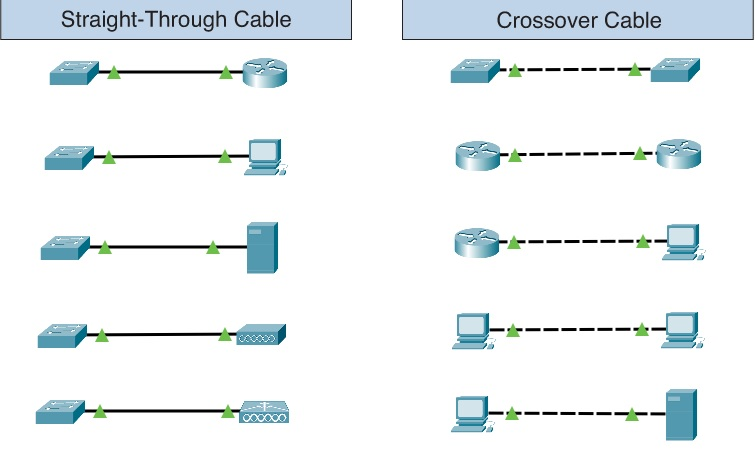

<!--  -->

# ابهامات
* پروتکل اسپنینگ تری
* یه دیوایس برای فهمیدن مک و آی پی بقیه دیوایس ها آرپ میزنه سوئیچ و بریج برای فهمیدن مک و آی پی بقیه چیکار میکنن ؟

# خلاصه ای از نکات مهم

* دو دستگاهی که از یک خانواده هستند می بایست با کابل  `cross`  به یکدیگر وصل شوند.

 

    

 

* کابل های کراس تا 100 متر جوابگو هستند ولی بهتر است در فاصله های بیشتر از 70، 80 متر از آنها استفاده نشود.
* تأثیرات طول کابل را اگر در `Preferences` فعال کردیم فقط در محیط Physical اعمال می‌شود و در محیط Logical تأثیری ندارد.
* در پکت تریسر هر جا که PT در اسم دیوایس های مشاهده کردیم به این معنی هست که که این دیوایس رو پکت تریسر طراحی کرده و در دنیای واقعی وجود ندارد.
* برای تغییر موقعیت دیوایس ها در محیط Physical از منو بالا و تب `Navigation` کمک می‌گیریم و همچنین با کمک دکمه `Back` در کنار `Navigation` می‌توان به یک بخش بالاتر منتقل شد.
* برای اتصالات بین 2 کامپیوتر که بیشتر از 100 متر فاصله دارند از `Repeater` های Active استفاده می‌کنیم که اصطلاحا به `Repeater` هایی گفته می‌شود که به برق متصل شوند.
* دستگاه `Hub` در اصل همون `Repeaeter` هست با تعداد پورت های بیشتر.
* دستگاه `Hub` اطلاعاتی که به سمتش میان رو BroadCast میکنه.
* دستگاه های `Repeaeter` که به صورت Active هستند در 2 طرفشان میتواند کابل هایی با حداکثر طول 100 متر قرار بگیرد که مجموع 2 طرف باید از 200 متر تجاوز نکند.
* نکته بالا بری موارد Passive به گونه ای هست که مجموع 2 طرف نباید از 100 متر بیشتر بشود چرا که `Repeaeter` های بدون برق کار باز تولید سیگنال را انجام نمی‌دهند.
* مفهوم دستگاه `Generic` در پکت تریسر به معنی این است که این دستگاه صرفا برای شبیه سازی در پکت تریسر طراحی شده است.
* دستگاه `Hub` یک دستگاه `Half Duplex` است یعنی از send , receive به طور همزمان پشتیبانی نمی‌کند در یک لحظه یک Interface یا ارسال اطلاعات رو انجام میده یا دریافت.
* به مشکل ارسال همزمان اطلاعات توسط 2 interface روی یک بستر مشترک `Collision` یا `تصادم` گفته می‌شود.
* داخل `Hub` به شکل توپولوژی Bus طراحی شده است.
* دستگاه `Bridge` شبکه ما رو به segment تبدیل میکنه که این موضوع باعث میشه `BroadCast Domain` ما کوچک تر بشه.
* بعد از `Hub` و `Bridge` دستگاه `Switch` معرفی شد که بر خلاف دو دستگاه قبلی قابلیت برنامه ریزی داشت (`Manageable` بود) و همچنین interface های خیلی بیشتری داشت و هوشمندتر عمل می‌کرد.
* 
## مفهوم subnet mask

# مواردی که ممکنه در محیط شبیه سازی مشکل ساز باشند
* فعال کردن گزینه تاثیرات طول کابل در قسمت `prefrences`
* فایل های ذخیره شده با ورژن های بالاتر پکت تریسر روی ورژن های پایین تر باز نمی شوند.

# ترمینال
* با اجرای عبارت `ncpa.cpl` در محیط `Run windows (Win + R)` می‌توان لیست کارت شبکه ها را مشاهده کرد و همچنین می‌توان در قسمت بالای `TCP/IPv4` در Properties از یک کارت شبکه قسمت بالایی IP ست کرد مشابه کاری که برای ست کردن DNS شکن انجام می‌دهیم.
* دستور `arp -a` برای نمایش ARP Table
* دستور `arp -d` برای حذف ARP Table
* 